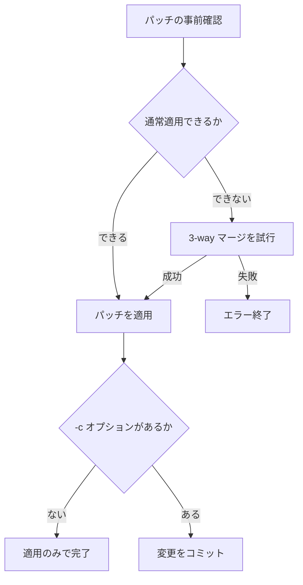

# Patch Management Flow

コミットごとの変更内容をファイルに出力し、別の Git リポジトリへ適用するためのツールです。

## 全体フロー


## 1. ファイルを生成する

開始コミットと終了コミットを指定して、`combined_patches.patch.md` を生成します。

```bash
./gdiffcomposer.sh <BASE_COMMIT> <TARGET_COMMIT>
```

出力先を指定する場合は、`-o` オプションを使用します。

```bash
./gdiffcomposer.sh -o <OUTPUT_DIR> <BASE_COMMIT> <TARGET_COMMIT>
```

生成されるファイルは次のとおりです。

```text
combined_patches.patch.md
```

## 2. ファイルを分割する

`combined_patches.patch.md` を、コミットごとのパッチファイルに分割します。

```bash
./split_patches.sh combined_patches.patch.md
```

出力先を指定する場合は、`-o` オプションを使用します。

```bash
./split_patches.sh -o <OUTPUT_DIR> combined_patches.patch.md
```

生成されるファイルの例は次のとおりです。

```text
diff_20260520_01.patch.md
diff_20260521_02.patch.md
diff_20260522_03.patch.md
```

## 3. パッチを適用する

分割されたパッチファイルを、ファイル名の順番で適用します。

コミットせずに適用する場合は、次のコマンドを実行します。

```bash
./apply_patches.sh
```

パッチを適用した後にコミットする場合は、`-c` オプションを指定します。

```bash
./apply_patches.sh -c
```

## 適用時の分岐



## 基本的な利用手順

```bash
# 1. ファイルを生成する
./gdiffcomposer.sh <BASE_COMMIT> <TARGET_COMMIT>

# 2. コミットごとのパッチファイルに分割する
./split_patches.sh combined_patches.patch.md

# 3. パッチを適用してコミットする
./apply_patches.sh -c
```

## 注意事項

- 各スクリプトは Git リポジトリ内で実行してください。
- `apply_patches.sh` は、カレントディレクトリ内の対象ファイルを処理します。
- `-c` を指定しない場合、パッチは適用されますがコミットは作成されません。
- パッチを適用できない場合は 3-way マージを試行し、それでも失敗した場合は処理を終了します。